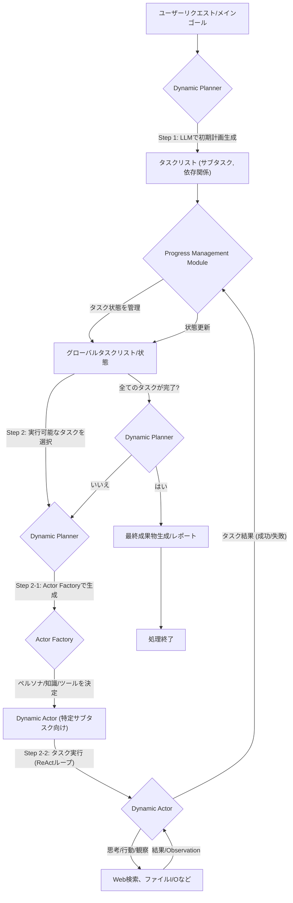
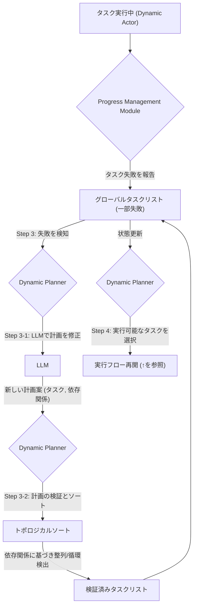

# Aime Framework 🚀

論文：[Aime: Towards Fully-Autonomous Multi-Agent Framework](https://www.arxiv.org/abs/2507.11988)

**Aime (Autonomous Intelligent-Multi-agent-Execution) Framework**は、複雑なタスクを解決するために設計された、動的マルチエージェント実行フレームワークです。

このフレームワークは、大規模言語モデル（LLM）の能力を活用し、単一の目標を達成可能なサブタスクに自動的に分解します。各サブタスクには、そのタスク遂行に最適化されたペルソナを持つ専門家エージェント（`Dynamic Actor`）が割り当てられ、並列で自律的にタスクを実行します。

タスクの失敗や予期せぬ状況が発生した際には、計画全体を動的に修正（`Adaptive Replanning`）する能力を持ち、堅牢で柔軟なタスク解決を実現します。

### ⚙️ アーキテクチャ

Aimeフレームワークは、連携して動作する4つのコアコンポーネントで構成されています。

- **`Dynamic Planner`**:
  タスク管理の中央オーケストレーター。高レベルの目標を実行可能なサブタスクに分解し、全体の進捗を監視します。タスクの失敗を検知すると、計画の再評価と修正をトリガーします。
- **`Actor Factory`**:
  サブタスクの要件に合わせて、特化した`Dynamic Actor`をインスタンス化する役割を担います。LLMを使い、タスクに最適なペルソナ（例：「東京の交通網に精通した交通コンサルタント」）を動的に生成します。
- **`Dynamic Actor`**:
  特定のサブタスクを実行するために専念する自律エージェント。ReActパラダイムを採用し、「思考→行動→観察」のサイクルを繰り返してタスクを遂行します。残りターン数を自己認識し、効率的なタスク完了を目指します。
- **`Progress Management Module`**:
  システム全体のタスク状態を管理する共有メモリ。全てのタスクのリアルタイムステータスを一元管理し、PlannerとActor間での一貫した進捗理解を保証します。

-----

### 実装内容


#### 主な特徴

- **動的タスク計画**: 単一のユーザーリクエストから、依存関係を持つサブタスクの実行計画（グラフ）を自動生成します。
- **適応的再計画**: タスクの失敗を検知すると、LLMが現在の進捗状況を考慮して計画を動的に修正・最適化します。
- **専門エージェントの動的生成**: サブタスクごとに、`ActorFactory`が最適なペルソナを持つ専門エージェントをその場で生成します。
- **並列タスク実行**: 依存関係が解決されたタスクは、`ThreadPoolExecutor`によって並列で実行され、処理時間を短縮します。
- **堅牢なエラーハンドリング**:
  - API呼び出しには指数関数的バックオフ付きのリトライ処理を実装。
  - 再計画されたタスクリストは、トポロジカルソートによって依存関係の矛盾がないか検証・整列されます。
- **高い観測性**: [Langfuse](https://langfuse.com/)との統合により、LLMの呼び出しやエージェントの思考プロセスを詳細に追跡・デバッグできます。

### 初期計画の生成と実行フロー



### タスク失敗と適応的再計画フロー



## 🚀 セットアップ方法

#### uvのインストール

```bash
# macOS/Linux
curl -LsSf https://astral.sh/uv/install.sh | sh

# Windows
powershell -c "irm https://astral.sh/uv/install.ps1 | iex"
```

#### リポジトリのクローン

```bash
git clone https://github.com/anyai-28/aime-workflow.git
cd aime-workflow
```

#### 依存関係のインストール

```bash
# 依存関係をインストール
uv sync
```

#### 環境変数の設定

```bash
cp .env_copy .env
```

.envファイルに各API情報を入力。

```bash
OPENAI_API_KEY="xxx"

LANGFUSE_PUBLIC_KEY="xxx"
LANGFUSE_SECRET_KEY="xxx"
LANGFUSE_HOST="xxx"

GOOGLE_API_KEY="xxx"
GOOGLE_CSE_ID="xxx"
```
- 参考
  - OpenAI
    - [api-keys](https://platform.openai.com/api-keys) の Create new secret keyで取得
  - LangFuse
    - [Langfuseを触ってみた](https://zenn.dev/cloud_ace/articles/44cb9bbcd92865)
  - Google custom search
    <details>
    <summary>手順</summary>

    - APIキーの取得

      1. Google Cloud Consoleにアクセスし、新しいプロジェクトを作成するか、既存のプロジェクトを選択します。
      2. ナビゲーションメニューから「APIとサービス」 > 「ライブラリ」を選択します。
      3. 「Custom Search API」を検索し、有効にします。
      4. 「APIとサービス」 > 「認証情報」に移動し、「+ 認証情報を作成」 > 「APIキー」を選択します。
      5. 作成されたAPIキーが表示されるので、コピーして安全な場所に保管してください。

    - プログラマブル検索エンジンID (CX) の取得
      1. Google プログラマブル検索エンジンのページにアクセスします。
      2. 「追加」ボタンをクリックして、新しい検索エンジンを作成します。
      3. セットアップ画面で、検索エンジンの名前を入力します。
      4. 「ウェブ全体を検索」オプションをオンに切り替えます。
      5. 「作成」をクリックします。
      6. 作成された検索エンジンの「基本」設定ページに移動し、「検索エンジン ID」をコピーします。これがGOOGLE_CSE_IDの値になります。

    </details>


## 🏃‍♀️ 実行方法

`main.py`内の`user_request`を解決したいタスクに変更し、スクリプトを実行します。

```python
# main.py
from planner import DynamicPlanner

def main():
    """メイン実行関数"""
    # .envファイルから環境変数を読み込む
    load_dotenv()
    
    # ... Langfuseのセットアップ ...
    
    # AimeのDynamic Plannerを初期化
    planner = DynamicPlanner()

    # ユーザーからのリクエスト
    user_request = (
        "東京での1泊2日の完璧な観光プランを作成してください。移動手段と予算の見積もりもお願いします。"
    )

    # Aimeフレームワークを実行
    planner.run(user_request)

if __name__ == "__main__":
    main()
```

実行コマンド：

```bash
python main.py
```

実行が完了すると、`final_report.md`に最終成果物が、`progress.md`にタスクの実行進捗が出力されます。

## 📁 プロジェクト構成

```text
.
├── main.py               # フレームワークの実行エントリーポイント
├── planner.py            # DynamicPlanner: 全体のオーケストレーター
├── actor.py              # DynamicActor: サブタスクを実行するエージェント
├── factory.py            # ActorFactory: エージェントを生成する工場
├── progress_manager.py   # ProgressManagementModule: 全体の進捗を管理
├── tools.py              # Web検索などのエージェントが利用するツール群
├── llm_client.py         # LLM API呼び出しを管理するクライアント
├── config.py             # システム全体の設定を管理
└── .env                  # 環境変数の設定ファイル (Git管理外)
```
